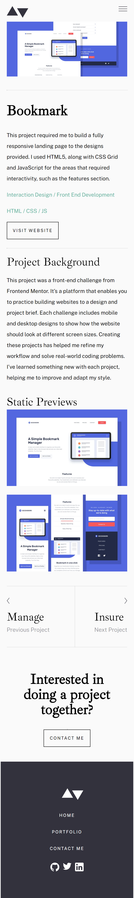

# Frontend Mentor - Minimalist portfolio website solution

This is a solution to the [Minimalist portfolio website challenge on Frontend Mentor](https://www.frontendmentor.io/challenges/minimalist-portfolio-website-LMy-ZRyiE). Frontend Mentor challenges help you improve your coding skills by building realistic projects. 

## Table of contents

- [Overview](#overview)
  - [The challenge](#the-challenge)
  - [Screenshot](#screenshot)
  - [Links](#links)
- [My process](#my-process)
  - [Built with](#built-with)
  - [What I learned](#what-i-learned)
  - [Continued development](#continued-development)
  - [Useful resources](#useful-resources)
- [Author](#author)
- [Acknowledgments](#acknowledgments)

## Overview

### The challenge

Users should be able to:

- View the optimal layout for each page depending on their device's screen size
- See hover states for all interactive elements throughout the site
- Click the "About Me" call-to-action on the homepage and have the screen scroll down to the next section
- Receive an error message when the contact form is submitted if:
  - The `Name`, `Email Address` or `Message` fields are empty should show "This field is required"
  - The `Email Address` is not formatted correctly should show "Please use a valid email address"

### Screenshot

### Links

- Solution URL: [Go to Solution Site](https://your-solution-url.com)
- Live Site URL: [Go to Live Site](https://minimalist-portfolio-website-2i9rer9co-faruking.vercel.app)

## My process

### Built with

- Semantic HTML5 markup
- CSS custom properties
- Flexbox
- Javascript
- Content-first workflow

### What I learned

I learnt how to create a forms with custom error messages, it was a challenge getting it to look like the design but I am glad to have finally gotten it done.  

### Continued development

I would like to learn more about forms in order to be a able to create some amazing ones. I will also like to hone my javascript skills. 

### Useful resources

- [form validation](https://css-tricks.com/form-validation-ux-html-css/) - This is an amazing article which helped me with form validation.
- [form validation](https://www.w3schools.com) -  This helped me with the form validation.

## Author
- Frontend Mentor - [@faruking2](https://www.frontendmentor.io/profile/faruking2)
- Twitter - [@faruking2](https://www.twitter.com/faruking2)

## Acknowledgments

Shout out to "vanzasetia" on "frontend-mentor" slack channel for pointing me in the right direction when looking for information about "form validation".  

